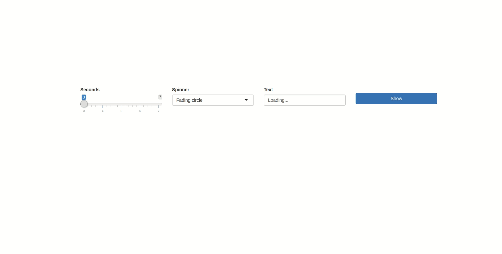

[](https://travis-ci.org/JohnCoene/waiter)

# waiter

Loading screens for Shiny; programatically show and hide a full page loading screen, comes with multiple spinners.



## Installation

``` r
# install.packages("remotes")
remotes::install_github("JohnCoene/waiter")
```

## How to

1. Place `use_waiter` anywhere in your UI.
2. Programatically call `show_waiter`
3. Don't forget to programatically hide the loading screen with `hide_waiter`

See `?spinners` for a list of all the spinners.

## Example

Basic example could be like this.

``` r
library(shiny)
library(waiter)
 
ui <- fluidPage(
  use_waiter(),
  actionButton("show", "Show loading for 5 seconds")
)

server <- function(input, output, session){
  observeEvent(input$show, {
    show_waiter(spin_fading_circles())
    Sys.sleep(4)
    hide_waiter()
  })
}

if(interactive()) shinyApp(ui, server)
```

How it is used in [chirp](https://chirp.sh)

```r
library(shiny)
library(waiter)

ui <- navbarPage(
  "example",
  id = "tabs",
    header = list(
        tags$style("nav{display:none;}")
    ),
  tabPanel(
    "home",
    use_waiter(),
    actionButton("switch", "Go to networks tab")
  ),
  tabPanel(
    "networks",
    h3("Hello!")
  )
)

server <- function(input, output, session){
  observeEvent(input$switch, {
    show_waiter(
      tagList(
        spin_folding_cube(),
        "Loading ..."
      )
    )
    Sys.sleep(5)
    updateTabsetPanel(session = session, inputId = "tabs", selected = "networks")
    hide_waiter()
  })
}

shinyApp(ui, server)
```
