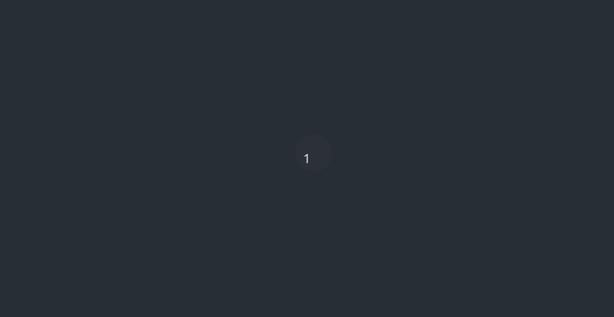

# The Waiter

The waiter lets you show splash loading screens. 

## How to

1. Place `use_waiter` anywhere in your UI.
2. Programmatically call `show_waiter` or use `show_waiter_on_load`.
3. Then hide the loading screen with `hide_waiter` or `hide_waiter_on_drawn`.

The waiter works hand-in-hand with the `steward` and the `hostess`. The former will let you animate the background of your loading screen while the latter will let you show loading bars on the loading screen.

> [!TIP]
> Make sure you include the dependencies with `use_waiter`.

## Examples

### Basics

A basic example could be like this.

``` r
library(shiny)
library(waiter)
 
ui <- fluidPage(
  use_waiter(), # include dependencies
  actionButton("show", "Show loading for 3 seconds")
)

server <- function(input, output, session){
  observeEvent(input$show, {
    waiter_show()
    Sys.sleep(3) # do something that takes time
    waiter_hide()
  })
}

shinyApp(ui, server)
```


### On Load

Since version `0.0.4` you can show on loading screen on app launch. The loading screen will launch prior to anything, even the Shiny session. Note that in `0.0.4` some content flashed before the loader appeared, this has been fixed in `0.0.5`.

> [!NOTE]
> You can have multiple waiters but only one active at a time.

Though this function is not programmatically launched it still has to be hidden with `hide_waiter`. Ensure you place `show_waiter_on_load` after `use_waiter` and at _the very end of your UI_, also set `include_js` to `FALSE`, in `use_waiter`.

```r
library(shiny)
library(waiter)
 
ui <- fluidPage(
  use_waiter(include_js = FALSE), # do not include js
  h3("Content you will only see after loading screen has disappeared"),
  waiter_show_on_load(html = spin_fading_circles()) # place at the bottom
)

server <- function(input, output, session){
  Sys.sleep(3) # do something that takes time
  waiter_hide()
}

shinyApp(ui, server)
```

How it is used in [chirp.sh](https://chirp.sh), where it is combined with [pushbar](https://github.com/JohnCoene/pushbar) to get rid of the navbar altogether. Note that we use the R6 class to create, show and hide the waiting screen. This is the preferred method as it comes with additional features which are covered later on.

```r
library(shiny)
library(waiter)

ui <- navbarPage(
  "example",
  id = "tabs",
    header = list(
        tags$style("nav{display:none;}") # hide navbar
    ),
  tabPanel(
    "home",
    use_waiter(),
    br(),
    actionButton("switch", "Go to networks tab")
  ),
  tabPanel(
    "networks",
    h3("Hello!")
  )
)

server <- function(input, output, session){
  observeEvent(input$switch, {

    # define a loding screen
    loading_screen <- tagList(
      spin_folding_cube(),
      span("Loading ...", style = "color:white;")
    )

    # create waiter and show loading screen
    w <- Waiter$new(html = loading_screen)$show()

    # long~ish computation
    Sys.sleep(3)

    # send to "hidden" tab
    updateTabsetPanel(session = session, inputId = "tabs", selected = "networks")

    # hide loading
    w$hide()
  })
}

shinyApp(ui, server)
```

### Dynamic Updates

You can, since version `0.0.6` update the `html` of the waiting screen while it's loading.

```r
library(shiny)
library(waiter)
 
ui <- fluidPage(
  use_waiter(),
  actionButton("show", "Show loading with updates")
)

server <- function(input, output, session){
  # create the waiter
  w <- Waiter$new(html = span("Initialisation", style = "color:white;"))

  observeEvent(input$show, {
    w$show()

    Sys.sleep(2)
    
    for(i in 1:5){
      HTML <- span(paste("Loading #", i, "of 5"), style = "color:white;z-index:999;")
      w$update(html = HTML)
      Sys.sleep(2)
    }

    w$hide()
  })
}

shinyApp(ui, server)
```


### Partial

Since version `0.1.0` you are not longer limited to full screen loading screen and can show the waiter only only part of the application, whichever part you desire. 

Let us demonstrate with a basic Shiny application that includes a single plot which is updated upon clicking an action button. The way we layer the waiter on top of an element is by simply specifying the `id` of the element we want the waiter to be layered over when we initialise the waiter.

```r
library(shiny)
library(waiter)

ui <- fluidPage(
  use_waiter(),
  actionButton("draw", "draw plot"),
  plotOutput("plot")
)

server <- function(input, output){

  # specify the id 
  w <- Waiter$new(id = "plot")

  dataset <- reactive({
    input$draw

    w$show()

    Sys.sleep(3)

    w$hide()    

    runif(100)
  })

  output$plot <- renderPlot(plot(dataset()))

}

shinyApp(ui, server)
```


We can actually further simplify the application above: we do not in fact need to use the `hide` method. By default when specifying an `id` waiter will hide the waiting screen when the element, in our case a plot, is re-rendered. This applies to plots, tables, htmlwidgets, etc. Below we simplify the app, removing the `hide` method and demonstrate that it works on a `tableOutput`.

```r
library(shiny)
library(waiter)
library(highcharter)

ui <- fluidPage(
  use_waiter(),
  actionButton("draw", "render stuff"),
  fluidRow(
    column(3, tableOutput("table")),
    column(9, highchartOutput("hc"))
  )
)

server <- function(input, output){

  # specify the id 
  w1 <- Waiter$new(id = "table")
  w2 <- Waiter$new(id = "hc")

  dataset <- reactive({
    input$draw

    w1$show()
    w2$show()

    Sys.sleep(3)

    head(cars)
  })

  output$table <- renderTable(dataset())
  output$hc <- renderHighchart({
    hchart(dataset(), "scatter", hcaes(speed, dist))
  })

}

shinyApp(ui, server)
```


Note that one might still want to use the `hide` method if one does not layer the waiting screen over a rendered element.

```r
library(shiny)
library(waiter)

ui <- fluidPage(
  use_waiter(),
  fluidRow(
    column(3, actionButton("draw", "render table")),
    column(
      9, 
      div(
        id = "waiter",
        style = "height:80vh;",
        h1("The plot"),
        plotOutput("plot")
      )
    )
  )
)

server <- function(input, output){

  # specify the id 
  w <- Waiter$new(id = "waiter")

  dataset <- reactive({
    input$draw

    w$show()

    Sys.sleep(3) 

    w$hide()

    runif(150)
  })

  output$plot <- renderPlot(plot(dataset()))

}

shinyApp(ui, server)
```


> [!INFO]
> All the features of the full screen are also available on partial loading screens

### With Hostess

Include the hostess dependencies with `use_hostess`, place the `hostess_loader` in the `show_waiter*` function then programmatically set the percentage with the `set` method. 

> [!TIP]
> Make sure you include the dependencies with `use_hostess`.

```r
library(shiny)
library(waiter)
 
ui <- fluidPage(
  use_waiter(include_js = FALSE), 
  use_hostess(),
  h3("Content you will only see after loading screen has disappeared"),
  waiter_show_on_load(hostess_loader("loader", preset = "bubble", center_page = TRUE)) 
)

server <- function(input, output, session){
  host <- Hostess$new("loader")

  for(i in 1:10){
    Sys.sleep(runif(1) * 1.2)
    host$set(i * 10)
  }

  waiter_hide()
}

shinyApp(ui, server)
```



The hostess-waiter team will also work as layers on parts of the application.

```r
library(shiny)
library(waiter)
 
ui <- fluidPage(
  use_waiter(), 
  use_hostess(),
  actionButton("draw", "plot"),
  plotOutput("plot")
)

server <- function(input, output, session){
  hostess <- Hostess$new()
  waiter <- Waiter$
    new(
      "plot", 
      html = hostess$get_loader(stroke_color = "#ffffff")
    )

  dataset <- reactive({
    input$draw
    waiter$show()

    for(i in 1:10){
      hostess$set(i * 10)
      Sys.sleep(.3)
    }

    runif(50)
  })

  output$plot <- renderPlot(plot(dataset()))
}

shinyApp(ui, server)
```


### With Steward

To use the steward, simply add `use_steward`, it takes a few arguments to customise its look and feel.

> [!TIP]
> Make sure you include the dependencies with `use_steward`.

```r
library(shiny)
library(waiter)
 
ui <- fluidPage(
  use_waiter(include_js = FALSE), 
  use_steward(),
  h3("Content you will only see after loading screen has disappeared"),
  waiter_show_on_load(spin_fading_circles()) 
)

server <- function(input, output, session){
  Sys.sleep(10) # do something that takes time
  waiter_hide()
}

shinyApp(ui, server)
```


### With garçon

Then again don't forget to add the dependency by placing `use_garcon` in the UI. Initialise the garçon then add progress by setting the percentage with the `set` method where you select the image to animate by passing its id.

> [!TIP]
> Make sure you include the dependencies with `use_garcon`.

```r
library(shiny)
library(waiter)

ui <- fluidPage(
  use_garcon(),
  use_waiter(),
  waiter_show_on_load(
    tags$img(
      src="https://waiter.john-coene.com/_assets/img/logo.png", 
      height=200, 
      id = "myImage" # set id
    )
  )
)

server <- function(input, output){
  g <- Garcon$new("myImage", filter = "opacity")

  for(i in 1:10){
    Sys.sleep(runif(1))
    g$set(i * 10)
  }

  waiter_hide()
}

shinyApp(ui, server)
```


There are a number of filters available.
