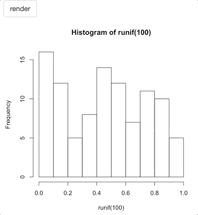

# The Waitress

The waitress will let you display loading bars on the entire screen or specific elements only.

## How to

Note that the waitress is a reference class.

1. Place `use_waitress` anywhere in your UI.
2. Set up the waitress in your server with `call_waitress` or `Waitress$new()`.
3. Programatically call the `set`, `inc`, and `auto` methods.
4. Don't forget to programatically hide the loading screen with the `close` method.

See `?waitress` for the documentation.

<Note type='tip'>
Make sure you include the dependencies with 
<code>useWaitress</code>.
</Note>

## Plot

The waitress can be applied to a specific element or the whole page. Note that `call_waitress` and `Waitress$new()` takes a CSS selector, so if you want to apply it to a plot use `#plotId`.

```r {highlight: [5,11,16,21]}
library(shiny)
library(waiter)

ui <- fluidPage(
  useWaitress(),
  plotOutput("plot", width = 400)
)

server <- function(input, output){
  
  waitress <- Waitress$new("#plot") # call the waitress
  
  output$plot <- renderPlot({
    
    for(i in 1:10){
      waitress$inc(10) # increase by 10%
      Sys.sleep(.3)
    }
    
    hist(runif(20))
    waitress$close() # hide when done
	})

}

shinyApp(ui, server)
```


## Selector

Because the waitress takes a selector, we can apply it to different parts of the page, using a class or any other selector, like the `nav`. Note that you can set the range of the progress bar when you initialise it, you are not limited to percentages.

```r {highlight: [8,16,21,26]}
library(shiny)
library(waiter)

ui <- navbarPage(
  "Waitress on nav",
  tabPanel(
    "home",
    useWaitress(),
    plotOutput("plot")
  )
)

server <- function(input, output){
  
  # now waitress ranges from 0 to 100
  waitress <- Waitress$new("nav", theme = "overlay", min = 0, max = 10)
  
  output$plot <- renderPlot({
    
    for(i in 1:10){
      waitress$inc(1) # increase by 10%
      Sys.sleep(.5)
    }
    
    hist(runif(100))
    waitress$close() # hide when done
  })

}

shinyApp(ui, server)
```


## Page

If you do not specify a selector to `call_waitress` then it is applied to the whole page. Note that you can change the color of the waitress in `use_waitress`.

```r {highlight: [5,12,'15-16',18]}
library(shiny)
library(waiter)

ui <- fluidPage(
  useWaitress(color = "#7F7FFF"),
  h2("waitress on entire page"),
  actionButton("load", "load")
)

server <- function(input, output){
  
  waitress <- Waitress$new(theme = "overlay-percent") # call the waitress
  
  observeEvent(input$load, {
    waitress$
      auto(percent = 5, ms = 150) # increase by 5 % every 150 ms
      Sys.sleep(3.5)
      waitress$close()
	})

}

shinyApp(ui, server)
```


## Infinite

An infinite loading bar is useful when you cannot compute increments.

```r {highlight: [5,12,17,22]}
library(shiny)
library(waiter)

ui <- fluidPage(
  useWaitress(),
  actionButton("btn", "render"),
  plotOutput("plot", width = 400)
)

server <- function(input, output){
  
  waitress <- Waitress$new("#btn", theme = "overlay", infinite = TRUE)
  
  output$plot <- renderPlot({
    input$btn

    waitress$start()
    
    Sys.sleep(3)
    
    hist(runif(100))
    waitress$close() # hide when done
  })

}

shinyApp(ui, server)
```



## Notifications

You can also use the waitress to display notifications.

```r {highlight: [5,12,18,21,26]}
library(shiny)
library(waiter)

ui <- fluidPage(
  useWaitress(),
  actionButton("btn", "render"),
  plotOutput("plot", height = "90vh")
)

server <- function(input, output){
  
  waitress <- Waitress$new(theme = "overlay-percent", min = 0, max = 10)
  
  output$plot <- renderPlot({
    input$btn

    # use notification
    waitress$notify()
    
    for(i in 1:10){
      waitress$inc(1) # increase by 10%
      Sys.sleep(.3)
    }
    
    hist(runif(100))
    waitress$close() # hide when done
  })

}

shinyApp(ui, server)
```


## Message

You can also layer a message on the waitress.

```r {highlight: [5,11,14,17,22]}
library(shiny)
library(waiter)

ui <- fluidPage(
  useWaitress(),
  plotOutput("plot")
)

server <- function(input, output){
  
  waitress <- Waitress$new("#plot") # call the waitress
  
  output$plot <- renderPlot({
    waitress$start(h3("Loading Stuff..."))
    
    for(i in 1:10){
      waitress$inc(10) # increase by 10%
      Sys.sleep(.3)
    }
    
    plot(runif(100))
    waitress$close() # hide when done
  })

}

shinyApp(ui, server)
```


## On render

Like the waiter, the waitress can be hidden when the element (plot, table, etc.) which it covers is rendered.

```r {highlight: [5,12,17,20]}
library(shiny)
library(waiter)

ui <- fluidPage(
  useWaitress(),
  actionButton("btn", "Render"),
  plotOutput("plot", width = 400)
)

server <- function(input, output){
  
  waitress <- Waitress$new("#plot", hide_on_render = TRUE) # call the waitress
  
  output$plot <- renderPlot({
    input$btn

    waitress$start()
    
    for(i in 1:10){
      waitress$inc(10) # increase by 10%
      Sys.sleep(.3)
    }
    
    plot(runif(100))
	})

}

shinyApp(ui, server)
```


## httr

Use instead of `httr::progress`, replace it with `httr_progress`.

```r
library(httr)
library(shiny)
library(waiter)

cap_speed <- config(max_recv_speed_large = 10000)

ui <- fluidPage(
  useWaitress(),
  actionButton(
    "dl",
    "Download"
  ),
  plotOutput("plot")
)

server <- function(input, output){
  w <- Waitress$new("#plot")

  dataset <- eventReactive(input$dl, {
    x <- GET(
      "http://httpbin.org/bytes/102400", 
      httr_progress(w), 
      cap_speed
    )

    runif(100)
  })

  output$plot <- renderPlot(plot(dataset()))
}

shinyApp(ui, server)
```


## withProgress

You can use `withProgressWaitress`, `setProgressWaitress`, and
`incProgressWairess`, they are used in a similar fashion as
`withProgress`, `setProgress`, and `incProgress` from shiny.

```r
library(shiny)
library(waiter)

ui <- fluidPage(
  useWaitress(),
  br(),
  actionButton(
    "load",
    "Load stuff"
  )
)

server <- function(input, output) {
  observeEvent(input$load, {
    withProgressWaitress({
      for (i in 1:15) {
        incProgressWaitress(1)
        Sys.sleep(0.25)
      }
    }, selector = "#load", max = 15, theme = "overlay-percent")
  })
}

shinyApp(ui, server)
```
